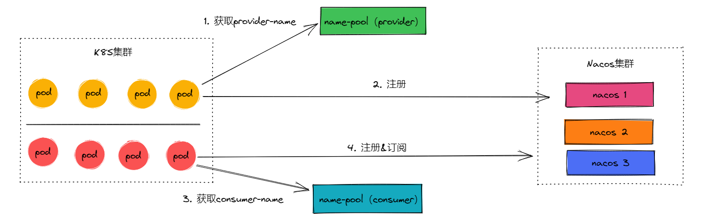

# nacos-sdk-go-example

简单写了 nacos 的 client-sdk-go 的几个样例，即 provider 与 consumer，consumer可以随机订阅指定范围的服务，
由于考虑到订阅问题，如果使用uuid，订阅的时候，比较难去指定服务名，所以写了一个 name-pool ，就是一个队列，启动sdk前
先去获取服务名，再去向注册中心注册相关信息，在从相关配置中知道需要订阅的服务名，再去订阅。

## 1. 测试方案
使用 k8s 集群去压测，分别去部署 provider 和 consumer，先去 name-pool 获取服务名字。

## 2. 目录介绍

**build:** 存放了 consumer 和 provider 相关的 Dockerfile 以及启动脚本。

**comd:** main函数文件目录。

**configs:** 配置文件目录。

**deployment:** 部署 provider 和 consumer 文件的yaml。

**docs:** 文档目录。

**pkg:** 具体实现目录。

